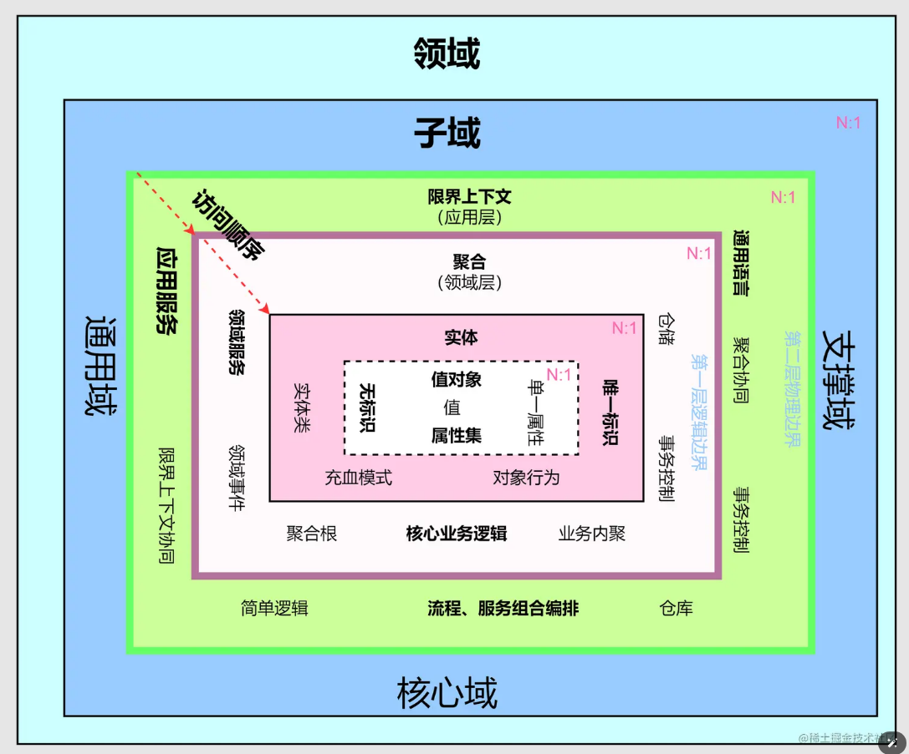
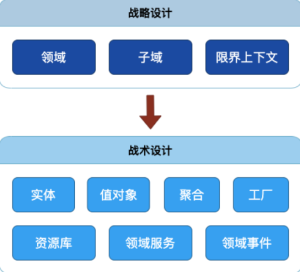
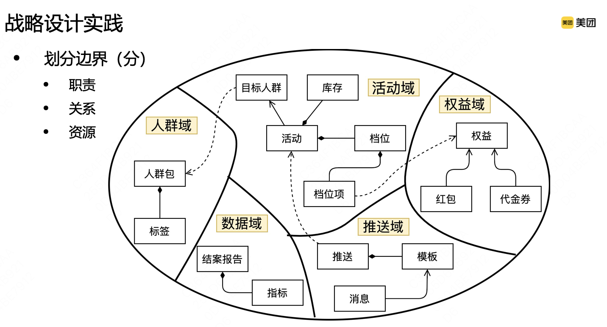
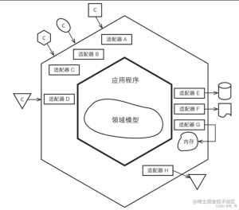
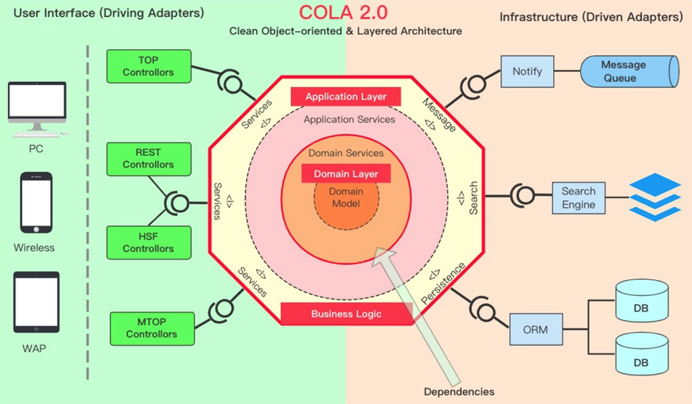
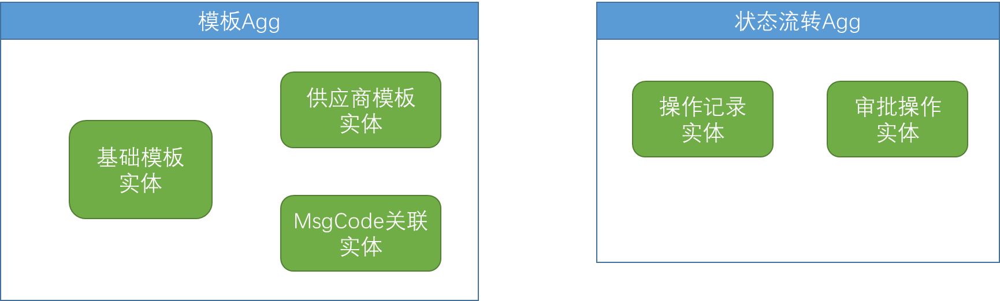
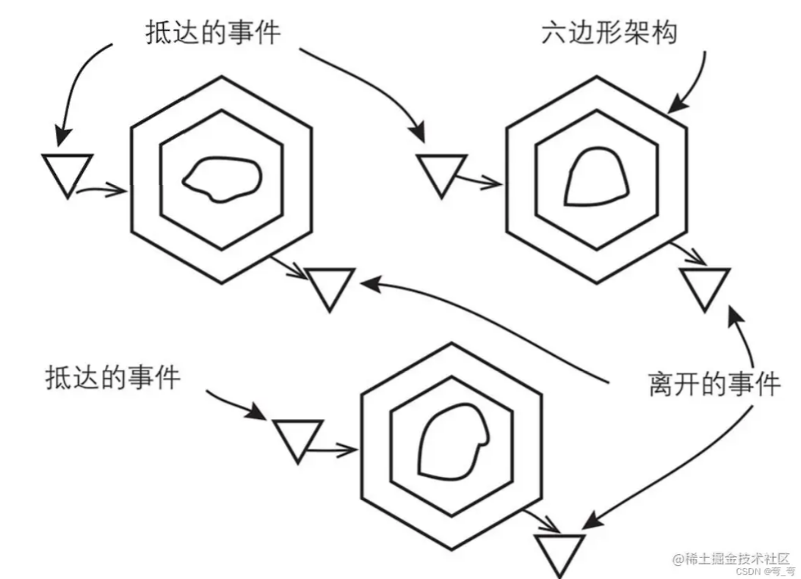
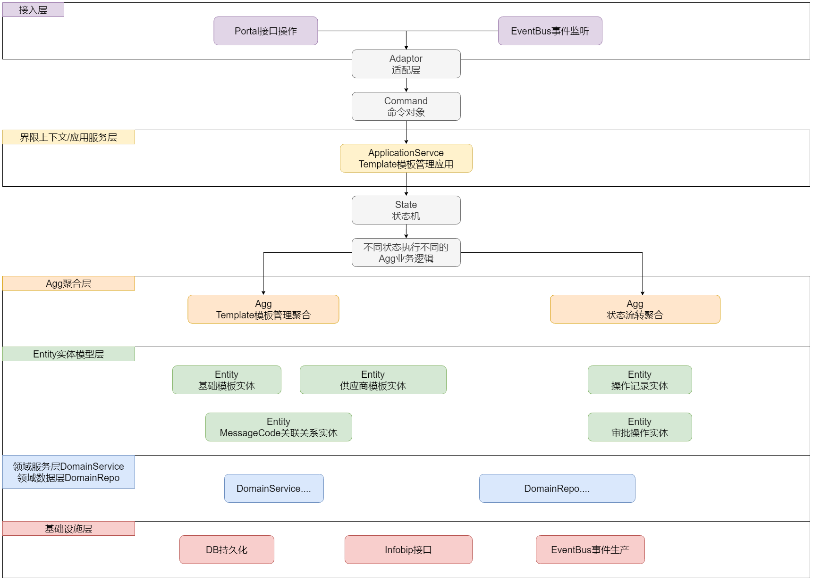
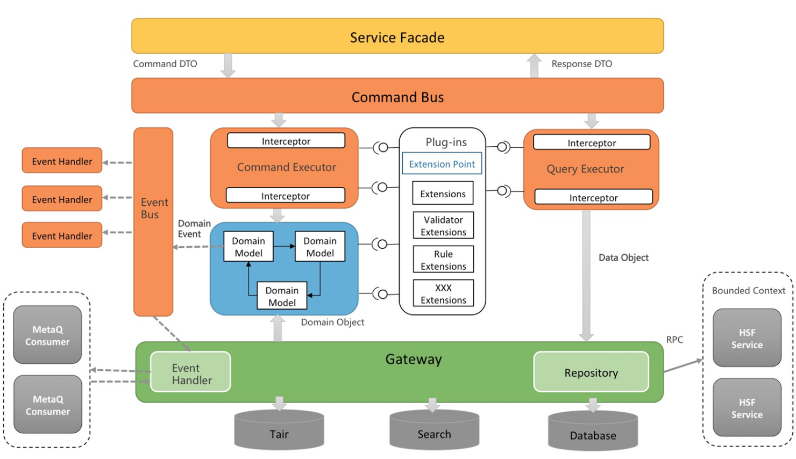

# 以模板管理系统为例的一种DDD设计

## 一、分工划分

为了能够并行的进行敏捷开发，分工上基于 **CQRS（命令和查询责任分离）** 的设计思路，以DB数据层为切割点，分为 **读模块** 和 **写模块**，从而可以各自独立开发。


#### 1、读模块
读模块直接操作DB数据表，采用 **MVC架构**，直接获取数据并进行组装，逻辑相对简单。

#### 2、写模块
写模块中，涉及到 _多版本、调用供应商、状态流转_ 等复杂逻辑，逻辑相对复杂。

若采用MVC架构，会导致Service层过于臃肿，逻辑耦合严重，不利于后续的理解维护和拓展。

故以下部分，将介绍使用 **DDD领域模型** 进行写模块的架构设计。

## 二、DDD架构设计

### 1、DDD架构简介

#### 1、在这里为什么选择使用DDD而不是MVC？

模板管理系统，涉及到 _多版本、调用供应商、状态流转_ 等复杂逻辑，逻辑相对复杂。

若采用MVC，将充斥着大量过程代码，一条线撸到底。后续难以进行理解维护和变更拓展。

**简单的业务系统采用这种贫血模型和过程化设计是没有问题的**，但在业务逻辑复杂了，业务逻辑、状态会散落到在大量方法中，原本的代码意图会渐渐不明确，我们将这种情况称为由贫血症引起的失忆症。

```text
MVC应用架构：

数据-应用(业务逻辑层)-展现，通常是以数据为起点进行数据库分析设计。

1). 服务层过重，数据模型失血，没东西；

2). 面条式编程或者面向数据库编程，服务层围绕数据库作业完成业务逻辑，经常一条线撸到底；

3). 代码一整块一整块的过重，很难扩展复用；

4). 数据库模型只是数据库映射，没有相关的行为支撑，行为都被上一层Service给完成等了，因此是失血的领域模型；
```

采用DDD，将复杂逻辑通过Model进行建模，可以更好的表达业务逻辑，也可以更好地控制后续变更的影响范围。

```text
DDD分层结构中将三层中业务逻辑拆解为应用层和领域层，核心业务逻辑表现下沉到领域层去实现，以业务领域模型为核心建模(面向对象建模)，更能体现对现实世界的抽象，其优点如下

1). 轻服务层+充血的领域模型；

2). 领域模型封装和实现各自应有的行为，可以认为是一个高内聚、低耦合的组件；

3). 由于模型集数据与行为于一身，是一种自解释的对象，代码复用性高，业务逻辑清晰明确;
```

综上，采用DDD进行设计。

#### 2、DDD的概念



DDD中充斥着大量的逻辑概念，有的非常抽象，难以理解。

这里不再赘述相关概念。

#### 3、更好的理解：类比组织架构


```text
康威（梅尔·康威）定律

任何组织在设计一套系统（广义概念上的系统）时，所交付的设计方案在结构上都与该组织的沟通结构保持一致。
```

_为了方便理解，我们可以以组织结构来进行类比：_



#### 一个完整的系统/领域：组织/CTO
一套完整的系统，一个组织所要做的整个事情。

比如比较大的，一套触达系统；比较小的，模板管理系统；再大，可以拆分子域(核心域、通用域、支持域...)

#### 限界上下文：产线/总监
按业务边界的划分，支持一个完整的子业务流程。

例如如果要设计一套触达系统，可以分为 CDP、CRM、MH 三个上下文，每个上下文有自己清晰的边界和专有概念。



从服务的角度看：一个上下文往往是一个/一套微服务，通过服务间通信进行交流。

从编程的角度看：使用 `应用服务ApplicationService类` 封装该上下文的所有业务操作，暴露具体的业务操作。接入层（soa、mq）通过适配器调用 ApplicationService。

**在模板系统中：**

比较简单的系统，只需要一个 上下文/ApplicationService 即可，无需拆分微服务。

接入层有soa接口、eventbus事件监听、mq(maybe)消息等





#### 聚合/聚合根（Agg）：研发团队/TO

一个上下文里，可以有多个聚合根：按照业务单一职责和高内聚原则进行划分。

可以看做实际干活的研发团队，可以把聚合根看作是TO。

聚合根中聚合了多个实体（员工），TO负责调用员工执行业务操作，以及做关联操作。

哪些实体该放到同一个聚合中呢：关联性极强，生命周期一致，具有联动合作关系。

聚合作为业务逻辑处理的实际载体，同时也是唯一可以外部访问的业务逻辑入口，通过 `命令对象Command类` 接收业务指令；外部不能直接访问内部实体

不同的聚合根之间，通过 `EventBus事件总线` 进行通信，从而使业务逻辑在每个Agg内部高内聚，多个Agg间松耦合。

**在模板系统中：**

**共划分出2个Agg：**

TemplateAgg：基础模板、供应商模板，还有其多版本、绑定关系、以及MessageCode绑定等。具有强关联联动关系，相同的生命周期。

OperationAgg：操作日志、审批通知等，与模板生命周期并非强关联。通过监听Template的EventBus，进行保存、审批通知的操作。

综上，1个 ApplicationService，通过 Cmd 调用2个 Agg 的业务逻辑。

#### 实体：员工

业务逻辑的执行实体，通俗意义上的充血模型。（持有业务逻辑的POJO）

Agg作为TO，可以把具体业务逻辑委托给具体Model（实体）进行操作。或者Agg直接执行多个实体的关联逻辑。

**好处：**

1、每个实体的业务逻辑，高度内聚。便于不同同学维护不同的逻辑，并行开发。

2、后续修改的半径清晰：比如供应商模板作为一个实体，后续如果更换供应商，仅需要修改对应实体内部的逻辑即可。

**在模板系统中：**

主要有5个实体Model，各自维护了内聚的业务逻辑：

1. 基础模板实体
    1. 基础模板的增删改查
    2. 基础模板的多版本更新
    3. 同供应商模板的绑定
2. 供应商模板实体
   1. 供应商模板数据的增删改查
   2. infobip的接口操作
3. MessageCode映射实体
   1. 模板和messagecode的查询
   2. 绑定、解绑操作
4. OperationLog操作记录实体
   1. 保存操作记录
5. Approve审批操作实体
   1. 触发审批通知



#### 值对象：

就是贫血模型，只有数据，没有逻辑。

和实体的区别在于，没有标识符，没有生命周期。

````text
实体 = 唯一身份标识 + 可变性【状态 + 行为】

值对象 = 将一个值用对象的方式进行表述，来表达一个具体的固定不变的概念。
````

#### 领域服务：
在充血模型POJO类中引入大量业务逻辑，会使得类臃肿且易崩溃。

`DomainService类` 其实就是把POJO中复杂的业务逻辑，拆分到对应的单独的类中进行管理。

不用于传统MVC的Service，DomainService的边界更加清晰，专为特定Model的业务逻辑。

#### 领域资源库：
DDD是业务架构，以上的模型中的逻辑，都是面向业务逻辑的。

一些技术性的语言，例如DAO的操作、供应商接口的调用，不是业务逻辑需要关心的。

故使用 `DomainRepository类` 对技术性语言进行封装，面向数据库持久化进行封装。

_举个例子：_

业务实体只关心数据以save，并不关心是insert还是update。所以在 DomainRepo 中判断数据是否存在，执行不同操作。

#### 工厂：

为什么工厂模式要单独说，因为Agg、实体等模型，是具有唯一标识符的，可以理解成，他们代表了数据库中实际的数据的载体。

所以，Agg、Model是不能简单的通过DTO转化而来，这样他们没有持久层对应的数据。

每次加载Agg、Model时，都应该通过工厂，从DB持久层中加载具体数据，再转化成模型对象。

#### 领域事件：

不同的ApplicationService、Agg之间，可以通过EventBus进行通信。



**在模板系统中：**

只有1个 ApplicationService、有2个Agg。Agg之间通过EventBus经由ApplicationService进行通信。

### 4、状态机设计
模板在不同的状态下，可以进行不同的操作，这是一个比较明显的状态机模型。

关于状态机的概念和设计，不再赘述。

针对以上的DDD说明：

业务逻辑封装在Agg和Entity中。所有的命令，都通过ApplicationService进入。

Application Service负责接收外部请求，协调领域对象的操作，并返回结果。在这一层级，可以通过状态机来管理和控制领域对象的状态转换和行为。

**故选择在ApplicationService层引入状态机。**

在这里，通过简单的 状态+事件接口，实现了一个简单的状态机。

并在ApplicationService层，封装了对状态机状态流转的事件发布机制。

### 5、综上：模板系统领域设计



### 参考图示：

